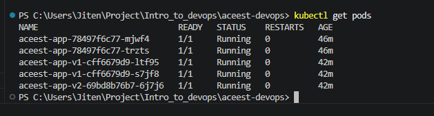
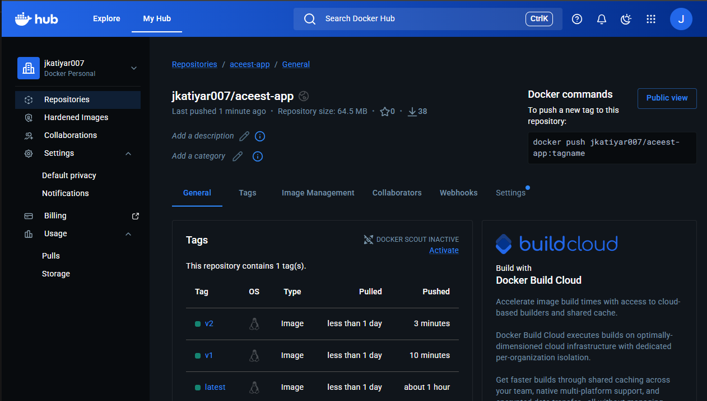
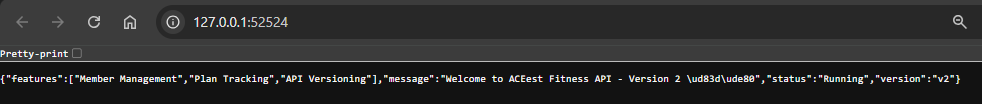
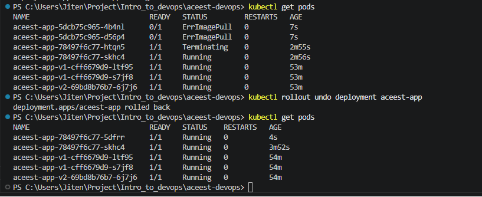
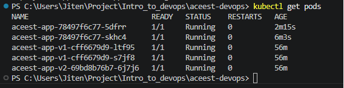

# ACEest DevOps Project – End-to-End CI/CD Pipeline with Kubernetes

## Overview

This project demonstrates a **complete DevOps lifecycle** for a Flask-based fitness API, covering:

* Continuous Integration (CI) using Jenkins
* Automated testing with Pytest
* Containerization using Docker
* Image publishing to Docker Hub
* Deployment on Kubernetes (Minikube)

---

## Architecture

```
GitHub → Jenkins → Pytest → Docker Build → Docker Hub → Kubernetes → Live App
```

---

## Project Structure

```
aceest-devops-assignment2/
│
├── app/                  # Flask application
├── tests/                # Unit tests (Pytest)
├── Dockerfile            # Docker build configuration
├── Jenkinsfile           # CI/CD pipeline
├── deployment.yaml       # Kubernetes Deployment
├── service.yaml          # Kubernetes Service
├── requirements.txt      # Python dependencies
└── README.md             # Project documentation
```

---

## Tech Stack

| Layer            | Tool                  |
| ---------------- | --------------------- |
| Backend          | Flask (Python)        |
| CI/CD            | Jenkins               |
| Testing          | Pytest                |
| Containerization | Docker                |
| Registry         | Docker Hub            |
| Orchestration    | Kubernetes (Minikube) |

---

## How It Works

### 1. Code Push

* Developer pushes code to GitHub

### 2. Jenkins Pipeline

* Pulls latest code
* Installs dependencies
* Runs tests (Pytest)

### 3. Docker Build

* Builds Docker image
* Tags image

### 4. Docker Hub

* Pushes image to Docker Hub repository

### 5. Kubernetes Deployment

* Pulls image from Docker Hub
* Deploys container using Deployment
* Exposes via NodePort Service

---

## Running Locally

```bash
pip install -r requirements.txt
python app/ACEest_Fitness.py
```

Access:

```
http://localhost:5000
```

---

## Docker Usage

### Build Image

```bash
docker build -t aceest-app .
```

### Run Container

```bash
docker run -p 5000:5000 aceest-app
```

---

## Kubernetes Deployment

### Apply Deployment & Service

```bash
kubectl apply -f deployment.yaml
kubectl apply -f service.yaml
```

### Check Pods

```bash
kubectl get pods
```

### Access Application

```bash
minikube service aceest-service
```

---

## Output

* Jenkins pipeline: ✅ Success
* Docker image: ✅ Available on Docker Hub
* Kubernetes pods: ✅ Running
* Application: ✅ Accessible via browser

---

## Best Practices Followed

* Used Docker access tokens instead of passwords
* Ignored database and sensitive files using `.gitignore`
* Implemented automated testing in pipeline
* Used containerized deployment

---

## Key Learnings

* End-to-end CI/CD pipeline design
* Docker image lifecycle management
* Kubernetes deployment and service exposure
* Jenkins credential management

---

## Author

**Jitendra Katiyar**

---

## Conclusion

This project demonstrates a **complete DevOps pipeline from code to production deployment**, simulating real-world workflows used in modern software engineering.


## Screenshots

### Kubernetes Pods


### Docker Images


### Version 1 Output


### Version 2 Output


### Rollback


### Canary Deployment
